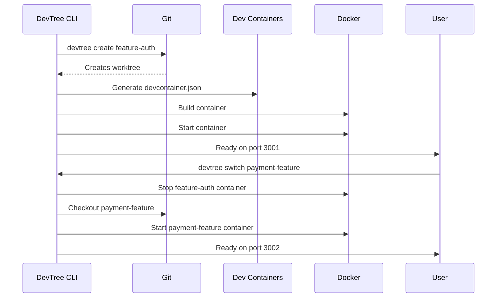
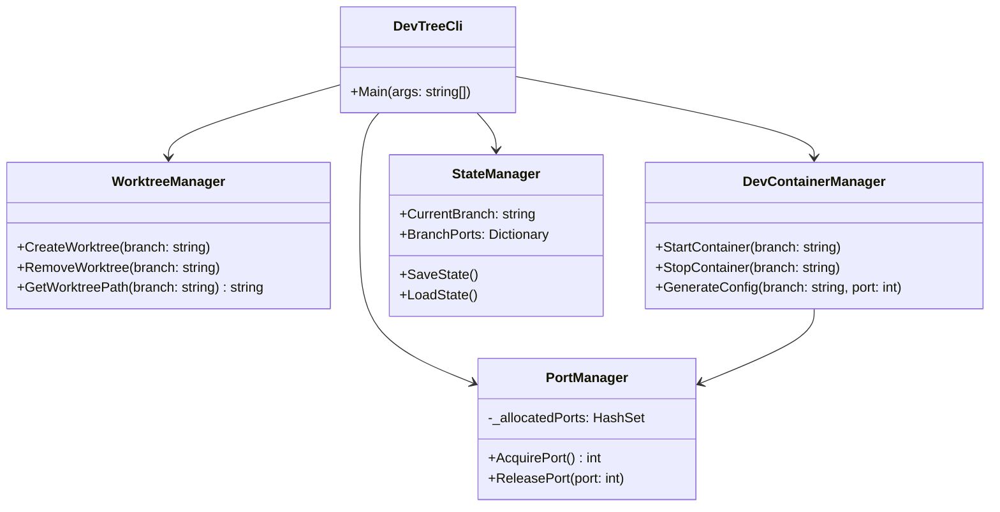

# DevTree: Git Worktree + Dev Containers Integration


**Seamlessly switch between Git branches with isolated development environments using Dev Containers**

## Problem Statement
As developers, we often struggle with:
- Context switching between branches/features
- Dependency conflicts between different tasks
- Time wasted reconfiguring environments
- "Works on my machine" issues

**DevTree solves these problems** by combining Git worktrees with dedicated Dev Containers for each branch.

## Key Features
✨ **Branch-specific environments**: Each branch gets its own isolated Dev Container  
⚡ **Instant context switching**: Move between tasks with a single command  
🔒 **Dependency isolation**: Prevent version conflicts between features  
🚀 **Parallel development**: Run multiple branches simultaneously on different ports  
💾 **Automatic configuration**: Dynamic port allocation and environment setup  
🔗 **VS Code integration**: Direct workspace switching  

## How It Works
DevTree creates a symbiotic relationship between:
1. **Git worktrees** (physical directory copies of your repository)
2. **Dev Containers** (Docker-based development environments)

Each branch exists in its own directory with a custom-configured Dev Container that has:
- Unique port assignments
- Isolated dependencies
- Branch-specific configurations
- Preserved runtime state

## Installation

### Prerequisites
- [.NET 6.0 SDK](https://dotnet.microsoft.com/download)
- [Git](https://git-scm.com/)
- [Docker Engine](https://docs.docker.com/engine/install/)
- [Dev Containers CLI](https://github.com/devcontainers/cli) (`npm install -g @devcontainers/cli`)
- [VS Code](https://code.visualstudio.com/) (recommended)

### Install DevTree
```bash
# Clone repository
git clone https://github.com/yourusername/devtree.git

# Build the tool
cd devtree
dotnet publish -c Release -o ./publish

# Add to PATH (Linux/macOS)
echo 'export PATH="$PATH:'$(pwd)'/publish"' >> ~/.bashrc
source ~/.bashrc

# Add to PATH (Windows)
[System.Environment]::SetEnvironmentVariable(
    "Path",
    [System.Environment]::GetEnvironmentVariable("Path", [System.EnvironmentVariableTarget]::User) + 
    ";C:\path\to\devtree\publish",
    [System.EnvironmentVariableTarget]::User)
```

## Getting Started

### 1. Initialize your project
```bash
mkdir my-project
cd my-project
git init
touch Dockerfile  # Add your base Dockerfile
devtree init
```

### 2. Create your first environment
```bash
devtree create --branch feature-auth
```

### 3. Work in your branch
```bash
# Start development environment
devtree start feature-auth

# Open in VS Code
code $(devtree path feature-auth)
```

### 4. Switch between branches
```bash
# Switch to another feature
devtree switch --branch payment-integration

# List all environments
devtree list
```

### 5. Clean up when done
```bash
devtree remove --branch feature-auth
```

## Workflow Example



## Class Diagram


## Advanced Usage

### Custom Dockerfiles
```bash
devtree create --branch experiment --dockerfile Dockerfile.experiment
```

### Port Management
```bash
# Reserve specific port
devtree create --branch docs --port 8080

# List used ports
devtree ports
```

### Environment Variables
```bash
# Set branch-specific variables
devtree env set feature-auth API_KEY=special_key

# View current environment
devtree env list feature-auth
```

### Preserving State
```bash
# Save container state
devtree snapshot create feature-auth

# Restore from snapshot
devtree snapshot restore feature-auth
```

## Configuration
Customize DevTree behavior via `.devtree/config.yaml`:

```yaml
worktrees:
  root: worktrees   # Worktree directory
  prefix: "branch-" # Directory prefix

devcontainers:
  base_config: .devcontainer/base.json # Shared configuration
  port_range: [3000, 4000]             # Allocatable ports
  auto_start: true                     # Start container on create

docker:
  cleanup: true        # Remove images on branch delete
  shared_volumes:      # Volumes to share between branches
    - common-cache
```

## Requirements
- **OS**: Windows 10/11, macOS 10.15+, Linux (kernel 5.0+)
- **Disk Space**: 1GB + project requirements
- **Memory**: 4GB+ (8GB recommended for multiple containers)

## Contributing
We welcome contributions! Please follow these steps:
1. Fork the repository
2. Create a feature branch (`git checkout -b feature/your-feature`)
3. Commit your changes (`git commit -am 'Add amazing feature'`)
4. Push to the branch (`git push origin feature/your-feature`)
5. Open a Pull Request

## Roadmap
- [x] Basic branch management
- [x] Dev Container integration
- [ ] VS Code extension
- [ ] CI/CD pipeline templates
- [ ] Performance optimizations
- [ ] Windows Terminal integration
- [ ] Remote development support

## License
DevTree is licensed under the MIT License - see the [LICENSE](LICENSE) file for details.

---

**Stop context switching, start developing!**  
Give your branches the isolated environments they deserve with DevTree.